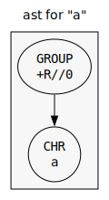
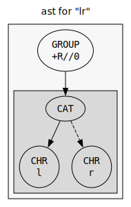
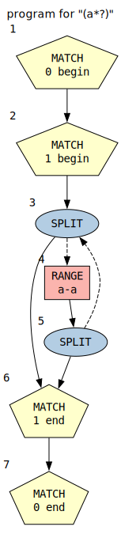
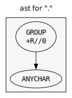
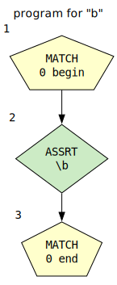

# AST

This page describes the implementation of the AST.

The engine builds an AST from the input regexp. The AST is analyzed and then compiled into the NFA program.

Each node in the AST has a type. Nodes have children and associated data depending on their type.

## AST Reference
### BBRE_AST_TYPE_EPS
An epsilon node.

#### Example: `|`

### BBRE_AST_TYPE_CHR
A single character.

#### Example: `a`

### BBRE_AST_TYPE_CAT
The concatenation of two regular expressions.
#### Arguments:
  -   Argument 0: left child tree (AST)
  -   Argument 1: right child tree (AST)

#### Example: `lr`

### BBRE_AST_TYPE_ALT
The alternation of two regular expressions.
#### Arguments:
  -   Argument 0: primary alternation tree (AST)
  -   Argument 1: secondary alternation tree (AST)

#### Example: `l|r`

### BBRE_AST_TYPE_QUANT
A repeated regular expression.
#### Arguments:
  -   Argument 0: child tree (AST)
  -   Argument 1: lower bound, always <= upper bound (number)
  -   Argument 2: upper bound, might be the constant `BBRE_INFTY` (number)

#### Example: `a+`

### BBRE_AST_TYPE_UQUANT
Like `QUANT`, but not greedy.
#### Arguments:
  -   Argument 0: child tree (AST)
  -   Argument 1: lower bound, always <= upper bound (number)
  -   Argument 2: upper bound, might be the constant `BBRE_INFTY` (number)

#### Example: `(a*?)`

### BBRE_AST_TYPE_GROUP
A matching group.
#### Arguments:
  -   Argument 0: child tree (AST)
  -   Argument 1: group flags pulled up, bitset of `enum group_flag` (number)
  -   Argument 2: group flags pulled down (number)
  -   Argument 3: capture index (number)

#### Example: `(?i-s:a)`

### BBRE_AST_TYPE_IGROUP
An inline group.
#### Arguments:
  -   Argument 0: child tree (AST)
  -   Argument 1: group flags pulled up, bitset of `enum group_flag` (number)
  -   Argument 2: group flags pulled down (number)

#### Example: `(?i-s)a`

### BBRE_AST_TYPE_CC_LEAF
A single range in a character class.
#### Arguments:
  -   Argument 0: character range begin (number)
  -   Argument 1: character range end (number)

#### Example: `[a-z]`

### BBRE_AST_TYPE_CC_BUILTIN
A builtin character class.
#### Arguments:
  -   Argument 0: starting index into the builtin_cc array
  -   Argument 1: number of character ranges to parse

#### Example: `[[:digit:]]`

### BBRE_AST_TYPE_CC_NOT
The set-inversion of a character class.
#### Arguments:
  -   Argument 0: child tree (AST)

#### Example: `[^a]`

### BBRE_AST_TYPE_CC_OR
The set-disjunction of a character class.
#### Arguments:
  -   Argument 0: child tree A (AST)
  -   Argument 1: child tree B (AST)

#### Example: `[az]`

### BBRE_AST_TYPE_ANYCHAR
Matches any character.

#### Example: `.`

### BBRE_AST_TYPE_ANYBYTE
Matches any byte.

#### Example: `\C`

### BBRE_AST_TYPE_ASSERT
Empty assertion.
#### Arguments:
  -   Argument 0: assertion flags, bitset of `bbre_assert_flag` (number)

#### Example: `\b`

