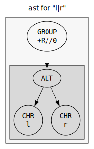
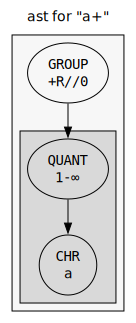
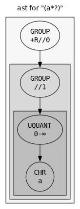
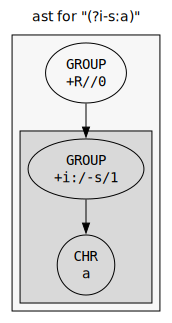
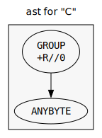

# AST

This page describes the implementation of the AST.

The engine builds an AST from the input regexp. The AST is analyzed and then compiled into the NFA program.

Each node in the AST has a type. Nodes have children and associated data depending on their type.

## AST Reference
### BBRE_AST_TYPE_CHR
A single character.

#### Example: `a`

### BBRE_AST_TYPE_CAT
The concatenation of two regular expressions.
#### Arguments:
  -   Argument 0: left child tree (AST)
  -   Argument 1: right child tree (AST)

#### Example: `lr`

### BBRE_AST_TYPE_ALT
The alternation of two regular expressions.
#### Arguments:
  -   Argument 0: primary alternation tree (AST)
  -   Argument 1: secondary alternation tree (AST)

#### Example: `l|r`

### BBRE_AST_TYPE_QUANT
A repeated regular expression.
#### Arguments:
  -   Argument 0: child tree (AST)
  -   Argument 1: lower bound, always <= upper bound (number)
  -   Argument 2: upper bound, might be the constant `BBRE_INFTY` (number)

#### Example: `a+`

### BBRE_AST_TYPE_UQUANT
Like `QUANT`, but not greedy.
#### Arguments:
  -   Argument 0: child tree (AST)
  -   Argument 1: lower bound, always <= upper bound (number)
  -   Argument 2: upper bound, might be the constant `BBRE_INFTY` (number)

#### Example: `(a*?)`

### BBRE_AST_TYPE_GROUP
A matching group.
#### Arguments:
  -   Argument 0: child tree (AST)
  -   Argument 1: group flags, bitset of `enum group_flag` (number)
  -   Argument 2: scratch used by the parser to store old flags (number)

#### Example: `(a)`

### BBRE_AST_TYPE_IGROUP
An inline group.
#### Arguments:
  -   Argument 0: child tree (AST)
  -   Argument 1: group flags, bitset of `enum group_flag` (number)
  -   Argument 2: scratch used by the parser to store old flags (number)

#### Example: `(?i)a`

### BBRE_AST_TYPE_CC
A character class.
#### Arguments:
  -   Argument 0: BBRE_REF_NONE or another CLS node in the charclass (AST)
  -   Argument 1: character range begin (number)
  -   Argument 2: character range end (number)

#### Example: `[a-zA-Z]`

### BBRE_AST_TYPE_ICC
An inverted character class.
#### Arguments:
  -   Argument 0: BBRE_REF_NONE or another CLS node in the charclass (AST)
  -   Argument 1: character range begin (number)
  -   Argument 2: character range end (number)

#### Example: `[^a-zA-Z]`

### BBRE_AST_TYPE_ANYBYTE
Matches any byte.

#### Example: `\C`

### BBRE_AST_TYPE_ASSERT
Empty assertion.
#### Arguments:
  -   Argument 0: assertion flags, bitset of `bbre_assert_flag` (number)

#### Example: `\b`

