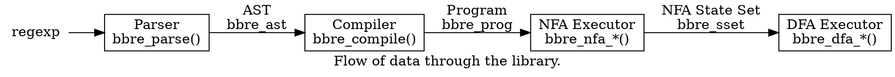

# Architecture

This regular expression library uses a tiered approach to matching text. A fast DFA can extract the outer boundaries of matches, while a slower NFA extracts submatches (groups).

This approach was chosen because if its execution time and space guarantees, not because of its simplicity. Many regular expression engines (including the venerable PCRE) use a method known as *recursive backtracking* to match text. Engines that implement recursive backtracking, given a regular expression with two possible paths, will attempt one path at a time, restarting the match if a path does not match. For example, such an engine would match the expression `aa|ab` against the string `ab` by taking the first path (`aa`), noting that it does not match `ab`, then backtracking to the beginning of the string to find that it matches `ab`. Recursive backtracking is easy to implement, and allows for useful features, including backreferences. However, diabolical regular expressions (or even seemingly benign ones) can cause it to take long amounts of time to match text. Crucially, the time a backtracking engine takes to match an expression has no relation to the length of the text the expression is matched against.

An automata-based approach like the one used in this library does not suffer from this issue. Regular expression engines that use automata derive a state machine that matches text described by the regexp. Every input byte of text to be matched advances the state machine in some way. In the above example, the state machine would consider both `aa` and `ab` in parallel, only stopping its consideration of `aa` once the final `b` in the input string is encountered. DFA/NFA-based matchers do not backtrack -- they guarantee that the input string is only scanned once, beginning to end. This is desirable because, unlike recursive backtracking, the algorithm is able to guarantee that it will finish in a reasonable amount of time. Unfortunately, these guarantees come with a price: convenience features such as backreferences are not possible, because they are [irregular](https://en.wikipedia.org/wiki/Pumping_lemma_for_regular_languages). It is the author's opinion that these features are usually unnecessary -- using backreferences in a regular expression is typically a sign that regular expressions are not the right tool for the job.

This library compiles an NFA from the input expression, and then dynamically builds a partial DFA from the NFA while matching text. This approach is often known as a "lazy DFA". Lazy DFAs are necessary because an NFA with `n` states may potentially describe a DFA with `2^n` states; therefore it is often not possible to build a full one. It turns out that this works well in practice, since most input text only ever uses a small fraction of all possible DFA states.

A consequence of the automata approach is that the engine becomes a compiler, as it builds a data structure that can be efficiently used to execute queries later on.



## Parser

The first stage of any compiler is the parser. The parser accepts a regexp string as input (`const char *`) and produces an [AST (abstract syntax tree)](https://en.wikipedia.org/wiki/Abstract_syntax_tree) as output.

The AST is stored in an arena allocator -- nodes and their data live in one big contiguous array. This is a good choice for the AST, because it is a complex graph that only grows in size, and it is freed all at once. Since ASTs are hierarchical, freeing a manually-allocated tree involves recursive traversal, which is undesirable as the depth of the AST is a property controlled by the user: a malicious input string could blow out the stack. The index 0 is reserved as a sentinel node in place of `NULL`.

The parser resembles a [Shunting-yard parser](https://en.wikipedia.org/wiki/Shunting_yard_algorithm) if squinted at. It maintains an argument stack and an operator stack. The operator stack tracks nested groups and alternations, while the argument stack tracks concatenations of adjacent expressions within a group or alternation. This approach was chosen as it is simple, so illegal states are easy to catch. Since writing a parser in C is possibly the most dangerous thing a programmer can attempt, great care was taken to reduce complexity in the parser. See [Testing](../Testing.md) for more details on how I test the safety of the parser.

## Code Generation

After the parser generates an AST, the `bbre_compile()` function kicks in, and walks the AST, transforming each node into a sequence of instructions. The instructions are later run by a set of threads in a [Pike VM](https://swtch.com/~rsc/regexp/regexp2.html).

There are four instruction opcodes:
```c
typedef enum bbre_opcode {
  BBRE_OPCODE_RANGE, /* matches a range of bytes */
  BBRE_OPCODE_SPLIT, /* forks execution into two paths */
  BBRE_OPCODE_MATCH, /* writes the current string position into a submatch */
  BBRE_OPCODE_ASSERT /* continue execution if zero-width assertion */
} bbre_opcode;
```

The compiler maintains an explicit stack, so that arbitrarily-nested regular expressions don't cause a stackoverflow. This stack is comprised of `bbre_compframe` objects that track the segment of the program corresponding to the currently-compiled AST node.

Each AST node's sequence of instruction has zero or one entry points and zero or more exit points. These exit points are referred to as "patches" in the code, because they are "patched" into another AST node by the compiler.
