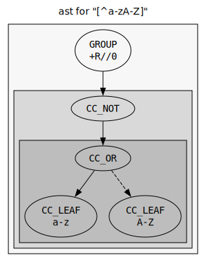
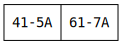
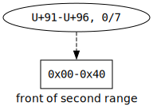
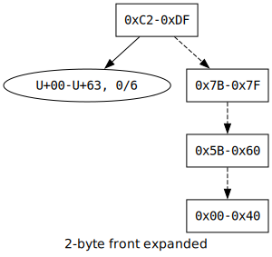

# Character Class Compiler

This page describes the design of the character class compiler used by the regex engine.

The compiler converts an input character class AST node into a sequence of NFA instructions. It operates in multiple stages.

## AST Decomposition

First, the AST decomposed into a sequence of ranges.

Consider this AST:

This becomes the sequence:

## Range Normalization

A sequence of ranges is *normalized* if:

1. The upper bound of every range is greater than or equal to its lower bound.
2. No two different ranges in the sequence intersect.
3. Ranges increase in the sequence monotonically.
4. No two subsequent ranges are adjacent: a range's upper bound is not the next range's lower bound minus one.

A normalized sequence of ranges has several desirable properties. If a sequence is normalized, it is the shortest sequence of ranges that describes its set of characters. Since a normalized sequence is sorted, it can often be processed in efficient linear passes.

The compiler first sorts the sequence of character classes by their lower bound. Next, in a linear pass, the compiler merges adjacent or intersecting ranges.

For the example character class, the sequence now becomes:

## Range Inversion

The character class needs to be inverted if the input AST node was an `ICLS` node and not a `CLS` node. If so, the compiler inverts the range in a linear pass. The resulting sequence of ranges is also normalized.

For the example character class, the sequence now becomes:

## Byte Length Conversion

The compiler splits the 32-bit codepoint ranges into sub-ranges corresponding to different UTF-8 byte lengths. Ranges are split if they cross the byte-length boundaries `U+80` (1/2 byte), `U+800` (2/3 byte), and `U+FFFF` (3/4 byte).

For the example character class, the sequence becomes:

## Tree Building

The compiler transforms the sequence of ranges into a binary tree that represents the UTF-8 encoding of the character class.

The tree has these properties:
- Nodes are ranges of *bytes*.
- A node *N*'s left child is a tree corresponding to an alternation with *N*. 
- A node *N*'s right child is a tree corresponding to a concatenation with *N*.

The tree is built by a recursively expanded front. The front is comprised of *front nodes* that represent yet-to-be-built subtrees.

The tree starts as a single front node, corresponding to the first UTF-8 range from the previous step.

The front node is converted to regular nodes until there are no front nodes left. 

The compiler moves to the next range, adding it as a front.

This process is continued until all ranges of a single byte length are added.

For multibyte sequences the front expands laterally, because multibyte sequences are concatenations.

Ranges are added until there are no ranges left.

## Tree Reduction

The generated tree contains many duplicated subtrees. To generate an optimal NFA, the compiler ensures that there is only ever one instance of a unique subtree.

The compiler reduces the deepest nodes first. Since the graph is acyclic, after a child node has been reduced, it does not need to be reconsidered.

## Reversal/Transposition

When generating code for a reversed NFA, the order of all concatenation expressions is swapped. So, we must reorient all concatenation edges in the tree.

## Program Generation

The compiler converts the tree into an NFA program. Shown is the forward NFA program for the tree.

Nodes correspond to `RANGE` instructions. Left edges (alternations) correspond to `SPLIT` instructions. Right edges (concatenations) correspond to the next instructions of `RANGE`s.

Note that deeper nodes are compiled first, so the program appears 'upside-down' compared to the tree.

